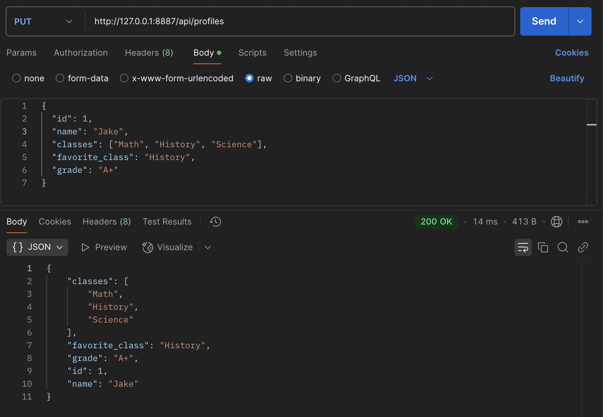
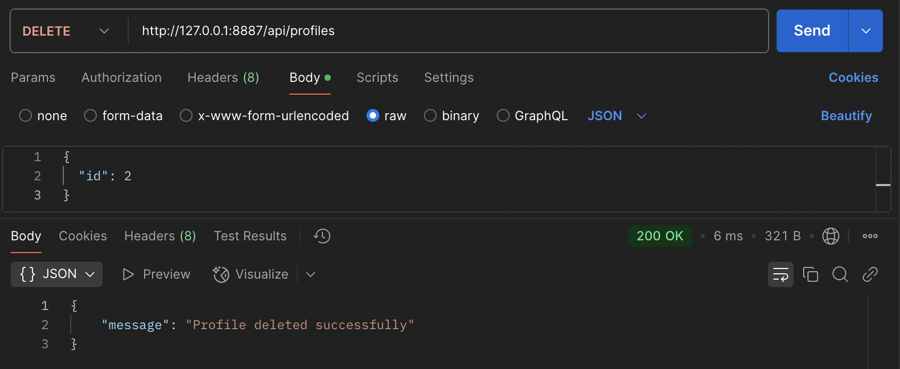

# Profile Management Feature Blog

*January 27, 2025 • By Arush Shah • 5 min read*


---

## Overview of the Program

Our team created a social media platform for students, focusing on personalized features to help them track and manage academic progress while staying connected with peers. The platform allows students to create, update, and delete their profiles, showcasing their classes, favorite subjects, and grades.

---

## Purpose of the Profile Feature

The profile feature provides a dynamic interface for students to:
- Add a new profile with details like name, classes, favorite class, and grade.
- Edit an existing profile by providing the profile ID and updated details.
- Delete a profile securely using its unique ID.

This feature is an essential component of the platform, enabling students to maintain an academic portfolio while ensuring data is secure and user-specific.

---


# AP CSP Create Performance Task (CPT) Guide

*February 2025 • By Arush Shah*

---

## **CPT Requirements Summary**
For the AP Computer Science Principles Create Performance Task (CPT), students must meet the following requirements:

1. **Input from One of the Following Sources:**
   - **User Input:** Data entered via a form, command line, or other interface.
   - **Device Input:** Data received from hardware (e.g., sensors, cameras).
   - **Online Data Stream:** Real-time data from APIs or external services.
   - **File Input:** Reading data from local files.

2. **Use of at Least One Collection Type:**
   - A **list, dictionary, set, or database** must be used to manage complexity and store data.
   - This helps organize and process information efficiently.

 **Lists (Rows):**  
In our Profile model, the `_classes` attribute is stored as a JSON column, allowing it to function like a list. Each profile can have multiple classes, and we provide methods to manipulate this list dynamically.


  ```python
  def add_class(self, class_name):
      if class_name not in self._classes:
          self._classes.append(class_name)
          db.session.commit()
          return True
      return False
  ```


 **Dictionaries (Columns):**  
The `read()` method converts the attributes of a profile(name, favorite class, grade, etc.) into a dictionary so that they can be easily returned as JSON in the API response.

  ```python
  def read(self):
    return {
        'id': self.id,
        'name': self.name,
        'classes': self.classes,
        'favorite_class': self.favorite_class,
        'grade': self.grade,
    }
  ```


The database is managed with SQLAlchemy, which simplifies database interactions. Each Profile represents a row in the table, and its attributes (name, classes, etc.) are stored as columns.


3. **A Student-Developed Procedure:**
   - **Defined Name:** The function must have a meaningful name - CANTELLA
   - **Return Type (if needed):** If the procedure returns a value, it must be specified.
   - **Parameters:** One or more parameters should be included.

4. **Algorithm with Key Elements:**
   - **Sequencing:** The procedure must execute steps in a logical order.
   - **Selection:** The procedure must use conditional logic (e.g., `if` statements).
   - **Iteration:** The procedure must include a loop (`for`, `while`, etc.).

5. **Calls to the Student-Developed Procedure:**
   - The function must be called at least once in the program.

6. **Program Output Based on Input & Functionality:**
   - The program must display output in one of the following ways:
     - **Tactile Output:** Haptic feedback (vibration, resistance).
     - **Audible Output:** Sound-based responses.
     - **Visual Output:** Graphs, images, or screen updates.
     - **Textual Output:** Text-based information in the console or GUI.

---

## **Input Implementation in My Program**
For my CPT project, I implement **user input** by allowing users to create and update their profiles through API requests.

### **Example: User Input via API**
When a user submits a profile form, the data is sent as a JSON object through a `POST` request:

```json
{
  "name": "John Doe",
  "classes": ["Math", "History"],
  "favorite_class": "Math",
  "grade": "A"
}


## Input/Output Demonstration

### Frontend Interface
The frontend provides an intuitive interface for creating, updating, and deleting profiles. Below is a sample of how the profile cards appear on the webpage.

**Profiles Frontend**  
<div style="display: flex; flex-wrap: wrap; justify-content: space-between; gap: 7px;">
    
</div>


---

### Using Postman for API Requests

#### 1. **Creating a Profile (POST)**  
Send a POST request to `/api/profiles` with the following JSON body:

```json
{
  "name": "John Doe",
  "classes": ["Math", "History"],
  "favorite_class": "Math",
  "grade": "A"
} 
```


#### 2. **Retrieving Profiles (GET)**  
Send a GET request to `/api/profiles` to retrieve all profiles.


#### 3. **Updating a Profiles (PUT)**  
Send a PUT request to `/api/profiles` with the following JSON body:

```json
{
  "id": 1,
  "name": "Jake",
  "classes": ["Math", "History", "Science"],
  "favorite_class": "History",
  "grade": "A+"
}
```



#### 4. **Deleting a Profile (DELETE)**  
Send a DELETE request to `/api/profiles` with the following JSON body:

```json
{
  "id": 2
}
```




You can see after all the API requests, John Doe was POSTed, Jake was PUT to replace Arush, and Jackson was DELETEd


### Use of Lists, Dictionaries, and Database
In the `Profile` model, lists, dictionaries, and a relational database are used to manage and manipulate data:

 **Lists (Rows):**  
In our Profile model, the `_classes` attribute is stored as a JSON column, allowing it to function like a list. Each profile can have multiple classes, and we provide methods to manipulate this list dynamically.


  ```python
  def add_class(self, class_name):
      if class_name not in self._classes:
          self._classes.append(class_name)
          db.session.commit()
          return True
      return False
  ```


 **Dictionaries (Columns):**  
The `read()` method converts the attributes of a profile(name, favorite class, grade, etc.) into a dictionary so that they can be easily returned as JSON in the API response.

  ```python
  def read(self):
    return {
        'id': self.id,
        'name': self.name,
        'classes': self.classes,
        'favorite_class': self.favorite_class,
        'grade': self.grade,
    }
  ```


The database is managed with SQLAlchemy, which simplifies database interactions. Each Profile represents a row in the table, and its attributes (name, classes, etc.) are stored as columns.


### Formatting Response Data (JSON) into DOM
The `read` method converts each profile into JSON format. The API sends this JSON data to the frontend, which updates the DOM (what the user sees on the webpage) - document object model. For example, when you retrieve all profiles, the `get` method collects all rows from the database, converts them to JSON, and sends them to the frontend.

  ```python
  def get(self):
    try:
        profiles = Profile.query.all()
        return jsonify([profile.read() for profile in profiles])
    except Exception as e:
        return {'message': f"An error occurred: {str(e)}"}, 500
  ```


### Algorithmic Code for Requests

  ```python
  class CRUD(Resource):
        def get(self):
            try:
                # Retrieve all profiles from the database
                profiles = Profile.query.all()
                return jsonify([profile.read() for profile in profiles])
            except Exception as e:
                return {'message': f"An error occurred: {str(e)}"}, 500

        def post(self):
            try:
                data = request.get_json()

                # Validate input data
                if not data:
                    return {'message': 'No input data provided'}, 400

                name = data.get('name')
                classes = data.get('classes')
                favorite_class = data.get('favorite_class')
                grade = data.get('grade')

                if not name or not favorite_class or not grade:
                    return {'message': 'Missing required fields'}, 400

                # Create and save the new profile
                profile = Profile(name=name, classes=classes, favorite_class=favorite_class, grade=grade)
                profile.create()

                return jsonify(profile.read()), 201
            except IntegrityError:
                db.session.rollback()
                return {'message': 'Profile with the same name already exists'}, 400
            except Exception as e:
                db.session.rollback()
                return {'message': f"An unexpected error occurred: {str(e)}"}, 500

        def put(self):
            try:
                data = request.get_json()

                # Validate input data
                if not data or 'id' not in data:
                    return {'message': 'No input data provided or missing ID'}, 400

                profile = Profile.query.get(data['id'])

                if not profile:
                    return {'message': 'Profile not found'}, 404

                # Update the profile
                profile.update(data)

                return jsonify(profile.read())
            except Exception as e:
                return {'message': f"An error occurred: {str(e)}"}, 500

        def delete(self):
            try:
                data = request.get_json()

                # Validate input data
                if not data or 'id' not in data:
                    return {'message': 'No input data provided or missing ID'}, 400

                profile = Profile.query.get(data['id'])

                if not profile:
                    return {'message': 'Profile not found'}, 404

                # Delete the profile
                profile.delete()

                return {'message': 'Profile deleted successfully'}, 200
            except Exception as e:
                return {'message': f"An error occurred: {str(e)}"}, 500
  ```

API Class Methods **(GET, POST, PUT, DELETE)**
The ProfileAPI class supports **CRUD** operations:

- *GET*: Retrieve profiles.
- *POST*: Create a profile.
- *PUT*: Update an existing profile.
- *DELETE*: Delete a profile.


### CRUD Methods
In the `Profile` model, lists, dictionaries, and a relational database are used to manage and manipulate data:

 - **Create**: Adds a profile to the database.

  ```python
  def create(self):
    db.session.add(self)
    db.session.commit()
    return self
  ```

 - **Read**: Fetches the profile details as a dictionary.

  ```python
  def read(self):
    return {
        'id': self.id,
        'name': self.name,
        'classes': self.classes,
        'favorite_class': self.favorite_class,
        'grade': self.grade,
    }
  ```

 - **Update**: Updates specific columns.

  ```python
  def update(self, inputs):
    self._name = inputs.get("name", self._name)
    self._classes = inputs.get("classes", self._classes)
    self._favorite_class = inputs.get("favorite_class", self._favorite_class)
    self._grade = inputs.get("grade", self._grade)
    db.session.commit()
    return self
  ```

 - **Delete**: Removes the profile from the database.

  ```python
  def delete(self):
    db.session.delete(self)
    db.session.commit()
  ```


### Queries to Extract Python Lists (Rows)
Using SQLAlchemy, rows from the database are converted into Python lists:


  ```python
  profiles = Profile.query.all()
  ```

This query retrieves all `profiles` table rows as a list of `Profile` objects. SQLAlchemy simplifies database operations with a Pythonic interface.


### Sequencing, Selection, and Iteration
The `POST` method demonstrates these programming principles:

- Sequencing: Steps like data extraction, validation, and object creation are executed in order.
- Selection: Conditional checks ensure required fields are provided.
- Iteration: Iteration over input data (if handling multiple objects) can be included.


### Parameters and Return Type
The `POST` method accepts JSON data from the request body and returns a JSON object as the response:

```python
    return jsonify(profile.read()), 201
```


### Fetch Requests to API Endpoints

```python
fetch('/api/profiles', {
    method: 'POST',
    headers: { 'Content-Type': 'application/json' },
    body: JSON.stringify({
        name: 'John Doe',
        classes: ['Math', 'Science'],
        favorite_class: 'Math',
        grade: 'A'
    })
})
.then(response => response.json())
.then(data => console.log(data));
```

### Handling Normal and Error Conditions
In the `POST` method:

- Normal Response:
```python
{
    "id": 1,
    "name": "John Doe",
    "classes": ["Math", "Science"],
    "favorite_class": "Math",
    "grade": "A"
}
```

- Error Response:
```python
{
    "message": "Profile with the same name already exists"
}
```


## Database Management

### **Database Initialization (`db_init`)**

The `db_init` function initializes the database by creating required tables and setting up the initial schema. We use this function when starting a new project or resetting an existing database to its default state.

#### **Command to Run Initialization**:
```bash
./scripts/db_init.py
```

<code>

    def initProfiles():
        with app.app_context():
            db.create_all()

            p1 = Profile(name='Arush Shah', classes=['Math', 'Science', 'History'],
                     favorite_class='Science', grade='A')
            p2 = Profile(name='Jackson Patrick', classes=['Art', 'Music', 'Literature'],
                     favorite_class='Art', grade='A+')
            p3 = Profile(name='Armaghan Zarak', classes=['Computer Science', 'Physics',     
                     'Biology'], favorite_class='Computer Science', grade='B+')


### **Database Backup (`db_backup`)**

The `db_backup` function allows you to safely back up the current state of your database. This ensures that your data is preserved and can be restored later in case of accidental deletion or other issues.

#### **Command to Run Backup**:
```bash
./scripts/db_backup.py
```


### **Database Restore (`db_restore`)**

The `db_restore` function allows you to revert your database to a previously saved state by restoring data from a backup file.

#### **Command to Run Restore**:
```bash
./scripts/db_restore.py
```
