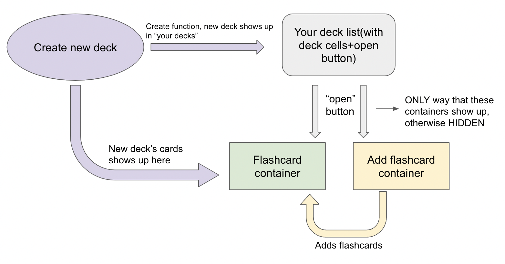
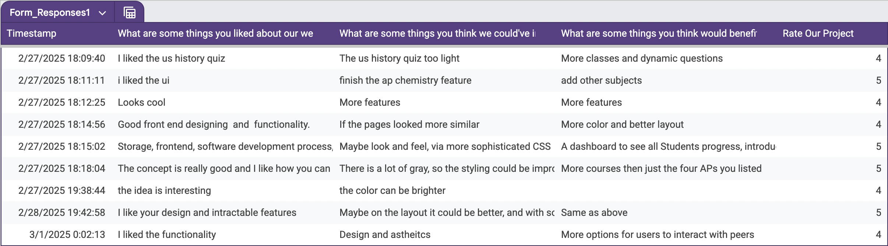
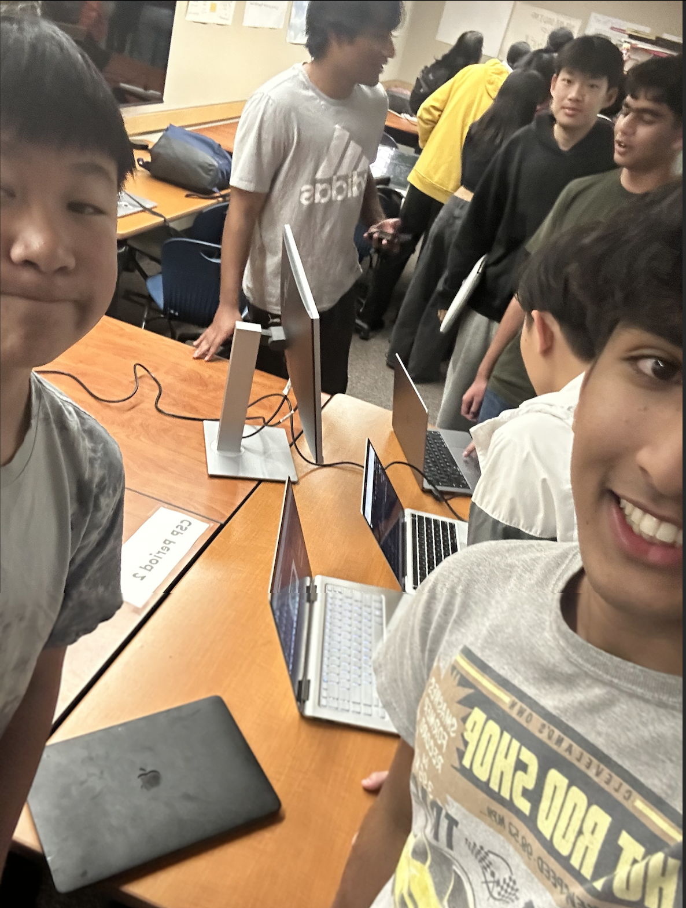

# 🎨 Cantella Retrospective Blog 🚀

## **🔎 Index**
- [🌐 Profile Feature: Core CPT Requirements & Implementation](#-profile-feature-core-cpt-requirements--implementation)
- [🎨 Role as UX Engineer](#-role-as-ux-engineer)
- [🎤 Night at the Museum (N@tM) Presentation](#-night-at-the-museum-natm-presentation)
- [📝 Personal Reflection: Strengths & Weaknesses](#-personal-reflection-strengths--weaknesses)
- [🚀 Future Plans & Next Steps](#-future-plans--next-steps)
- [🎯 Summary for Live Review](#-summary-for-live-review)

---

# 🌐 **Profile Feature: Core CPT Requirements & Implementation**

## **📌 GitHub Issues & Burndown List**
🔗 <a href="https://github.com/XavierTho/cantella_backend/issues/27#issue-2776751759" >Profiles Github Issue</a>

---

## **🛠️ 1. Setting Up an API (Starting with Static Data)**

### **CPT Requirement: Data Abstraction & Program Implementation**
- **What I Did:**
  - Started with **static data** to simulate profile storage before integrating a database.
  - Built an **API using Flask & Flask-RESTful**, setting up basic GET/POST routes.

### **Code Example:**
```python
# Blueprint setup
profile_api = Blueprint('profile_api', __name__, url_prefix='/api')
api = Api(profile_api)

# Static Data (Initial Setup)
profiles = [
    {"id": 1, "name": "Arush", "favorite_class": "Math", "grade": "B"},
    {"id": 2, "name": "John", "favorite_class": "Science", "grade": "A"}
]
```

### **How This Meets CPT Requirements:**
✅ **Data Abstraction:** Started with a simple list structure before transitioning to a full database.

✅ **Modularity:** Used Flask **Blueprints** for better organization.

✅ **Algorithmic Thinking:** Designed RESTful API endpoints for future integration.

---

## **💾 2. Setting Up a Model & Database (Ensuring Data Persistence)**

### **CPT Requirement: Data Storage & Testing**
- **What I Did:**
  - Designed a **Profile model** in SQLAlchemy.
  - Created a **relational database table** to store user data persistently, including the tester data.
  - Used **Postman** to verify CRUD operations before implementing the frontend.

### **Database Table Structure:**
📸 

### **Code Example:**
```python
class Profile(db.Model):
    __tablename__ = 'profiles'

    id = db.Column(db.Integer, primary_key=True)
    _name = db.Column(db.String(255), nullable=False)  # User's name
    _classes = db.Column(db.JSON, nullable=False)  # JSON column to store classes
    _favorite_class = db.Column(db.String(255), nullable=False)  # Favorite class
    _grade = db.Column(db.String(10), nullable=False)  # Grade
```

### **Postman Testing:**
📌 **Tested API endpoints for:**
- **GET /api/profiles** → Fetch all profiles.
- **POST /api/profiles** → Add new profiles.
- **PUT /api/profiles** → Update an existing profile.
- **DELETE /api/profiles** → Remove profiles.

### **How This Meets CPT Requirements:**
✅ **Data Storage:** Ensured user data is stored persistently in a database.

✅ **Testing & Debugging:** Used Postman to verify API functionality.

✅ **Program Implementation:** Designed models using SQLAlchemy ORM.

---

## **🌍 3. Full Stack Integration (Connecting API to Frontend)**

### **CPT Requirement: Data Representation & User Interaction**
- **What I Did:**
  - Created a **frontend UI** that dynamically interacts with the backend.
  - Used **JavaScript Fetch API** to display profiles in real-time.
  - Ensured users could **create, read, update, and delete profiles** seamlessly.
  - Learned the implementation of fullstack through **tech talks**


### **Code Example:**
```javascript
  try {
      const response = await fetch(`${API_BASE}`, {
      method: 'PUT',
      headers: { 'Content-Type': 'application/json' },
      body: JSON.stringify(data),
      credentials: 'include'
     });
```


### **How This Meets CPT Requirements:**
✅ **User Interaction:** Created a seamless UI for profile management.

✅ **Data Representation:** Dynamically displayed profile data from API calls.

✅ **Integration:** Connected **backend API with frontend logic**.

---

### **Live Demo of Profile Feature 🎥**

# 🎨 **Role as UX Engineer**

## **📌 GitHub Issues & Burndown List**

🔗 <a href="https://github.com/XavierTho/cantella_frontend/issues/76" >UX Engineer Github Issue</a>

---


## **📚 4. Flashcards Page - Streamlined User Experience**
🎯 **Objective:** Enhance functionality and ease of use.
🛠 **Implementation:**
- Used **progressive disclosure** to reveal UI elements only when needed.
- Designed a clean interface where **"Add New Flashcard"** appears only after selecting a deck.
- Utilized **conditional rendering** in JavaScript.


📊 **Flashcards Flowchart:** *(inspriation from the student panel)*



---

## **🎨 5. General Aesthetics & Website Unity**
🎯 **Objective:** Maintain a professional and cohesive UI.
🎨 **Implementation:**
- Used **grey background with orange accents** throughout different pages on the site for consistency.
- Standardized UI elements across all pages.
- Added **favicons (pencil & trashcan icons) and delete sound effect** for usability.


---

# 🎤 **Night at the Museum (N@tM) Presentation**

 
 

<div>


</div>

## 🎤 Night at the Museum (N@tM) Feedback Summary  

<table>
  <tr>
    <th style="color: #4CAF50; font-size: 18px;">✅ Positive Feedback</th>
    <th style="color: #FF9800; font-size: 18px;">🔹 Areas for Improvement</th>
  </tr>
  <tr>
    <td>
      <ul>
        <li><b>User Interface & Design</b> – Many users praised the <b>UI and front-end design</b>, mentioning that it looked <b>cool, interactive, and well-structured</b>.</li>
        <li><b>Functionality & Concept</b> – Users appreciated the <b>storage system, software development process, and overall concept</b> of the project.</li>
        <li><b>Engagement & Features</b> – People liked the <b>US History quiz, interactivity, and ability to store information</b> effectively.</li>
      </ul>
    </td>
    <td>
      <ul>
        <li><b>Feature Expansion</b> – Feedback suggested adding <b>more features</b>, such as <b>additional AP subjects</b> and making the <b>pages look more uniform</b>.</li>
        <li><b>Navigation & UI Improvements</b> – Some mentioned that <b>layout adjustments</b> and a <b>more sophisticated CSS design</b> could enhance the user experience.</li>
      </ul>
    </td>
  </tr>
</table>

---

### 🚀 **Suggestions for Future Development**
<table>
  <tr>
    <td style="background-color: #2196F3; color: white; padding: 10px;"><b>🛠 More Interactive Elements</b></td>
    <td>Users wanted <b>dynamic questions</b> and more ways to engage with the platform.</td>
  </tr>
  <tr>
    <td style="background-color: #009688; color: white; padding: 10px;"><b>📚 Expanded Course Offerings</b></td>
    <td>Requests were made to <b>include more AP courses</b> beyond the current selection.</td>
  </tr>
  <tr>
    <td style="background-color: #FF5722; color: white; padding: 10px;"><b>👥 Improved Social Interaction</b></td>
    <td>Users suggested adding <b>peer interaction features</b> to make the platform more engaging.</td>
  </tr>
</table>

---

### ⭐ **Overall Project Rating**
<center>
  <p style="font-size: 20px; color: #FFD700;"><b>🌟 4.5/5</b></p>
  <p>The majority of participants rated the project highly, showing strong appreciation for its functionality and design.</p>
</center>

This feedback provides great insight into **what worked well** and **what needs improvement** for future iterations of Cantella! 🚀

---

# 📝 **Personal Reflection: Strengths & Weaknesses**

| **Strengths** | **Weaknesses** |
|--------------|---------------|
| *Communication/Collaboration:* I was able to communicate very well with my group, setting up meetings, calls, and more. We were able to stay on the same page a lot which helped streamline this project. Additionally, we shared ideas very beneficially and were able to collaborate clearly, avoiding conflicts. | I think I can be more active in class and ask more questions to get to my answers faster. I will definetely work in this next tri. |
| *Troubleshooting:* I have been able to quickly understand challenges and issues that arose in our project which was very beneficial to troubleshoot for the whole group to be more productive. | At times, I have relied on last minute efforts to finish my work which could be done better with better time management. |
| *Adaptability:* I have been able to adapt during this project which has proven beneficial to my team and my personal work. It has been key to making sure I can work around the many issues that arise while working on code. It is something that I have grown in during the tri, and aqcquired while working on more and more things. | Sometimes I may focus on certain problems/goals within the project too much, which makes me spend too much time on things that may be more unnecessary. I can improve this my creating lists to clearly see what is the most important and first priority of work. These lists would improve efficiency greatly. |


<h3> <b>Solutions:</b> Next trimester I will focus on a few main things. Asking more questions, participating more in class, and creating more burndown lists and issues to be more clear on my work. 
</h3>
---

# 🚀 **Future Plans & Next Steps**

## **🌟 Future of Cantella**
- Adding **dark mode** for accessibility.
- Adding more fields to my profile feature for more student user info - possible connecting to other features like quizzes and flashcards
- Adding a chat so users can interact more

## **🎓 Future Projects & Application of CSP Knowledge**
- Majoring in **Data Science**.
- Attending **Boston University Data Science Summer Course**.
- Future projects - already thinking of ideas like a DMV appointment notify site.

---

<!-- Reaching Out & Helping Someone Section -->
<section style="background-color: #f8f9fa; padding: 20px; border-radius: 10px; margin-top: 20px;">
    <h2 style="color: #007bff;">🤝 Collaboration with Brandon Smurlo</h2>
    
    <p><b>For the final review, I partnered with Brandon Smurlo from a different period.</b> We helped each other prepare by setting up materials, reviewing each other’s websites, and conducting a <b>mock presentation</b> of our projects.</p>

    <!-- Image of Studying Together -->
    <div style="text-align: center; margin-bottom: 15px;">
        
        <p style="font-size: 14px; color: #555;">📸 Studying together for the final exam</p>
    </div>

    <h3 style="color: #28a745;">🔍 Feedback from Brandon on My Blog & Website</h3>

    <ul style="list-style-type: none; padding-left: 0;">
        <li style="background-color: #e9ecef; padding: 10px; border-radius: 5px; margin-bottom: 5px;">
            📝 <b>Blog Readability:</b> "The blog's format makes it difficult to pick out individual sections that work to fulfill each requirement."
        </li>
        <li style="background-color: #e9ecef; padding: 10px; border-radius: 5px; margin-bottom: 5px;">
            🎨 <b>Visual Enhancements:</b> More visuals instead of mostly text would help readers engage with key takeaways.
        </li>
        <li style="background-color: #e9ecef; padding: 10px; border-radius: 5px; margin-bottom: 5px;">
            📊 <b>Flowchart Feedback:</b> The flowchart is "very thought out and effective in conveying the steps you took to complete your feature."
        </li>
        <li style="background-color: #e9ecef; padding: 10px; border-radius: 5px; margin-bottom: 5px;">
            🖥️ <b>Website Design:</b> "I can tell that a lot of thought went into each and every feature, button, and animation."
        </li>
        <li style="background-color: #e9ecef; padding: 10px; border-radius: 5px; margin-bottom: 5px;">
            ⚠️ <b>Usability Issue:</b> When adding a new profile, the form appears at the bottom of the page, requiring users to scroll down—this is inconvenient.
        </li>
    </ul>

    <h3 style="color: #17a2b8;">📌 How This Helped Me Prepare</h3>
    <p>
        Brandon's feedback allowed me to pinpoint areas that need improvement before the final review. Based on his suggestions, I will:
    </p>
    <ul>
        <li>🔹 Improve the <b>blog's organization</b> to make requirements clearer.</li>
        <li>🔹 Add <b>more visuals</b> to break up text-heavy sections.</li>
        <li>🔹 Fix the <b>profile creation UI issue</b> so users immediately see when a new profile is added.</li>
    </ul>

    <p><b>By exchanging feedback and practicing presentations, we both strengthened our final exam preparation.</b> This collaboration gave us a fresh perspective on our projects and helped refine our work.</p>
</section>


## 📝 Self-Grade Assessment

### 📊 Main Evaluation (9 Points)
<table border="1" cellpadding="8" cellspacing="0">
  <tr>
    <th>Criteria</th>
    <th>Self-Grade</th>
    <th>Explanation</th>
  </tr>
  <tr>
    <td>🖐 <b>Five things I did over 12 weeks</b> (5 pts)</td>
    <td>4.5/5</td>
    <td>I accomplished a lot in the 12 weeks and learned a lot, especially through the 5 things I presented. I could have asked more questions during this process, though</td>
  </tr>
  <tr>
    <td>🎥 <b>Full Stack Project Demo</b> (2 pts)</td>
    <td>2/2</td>
    <td>My feature has full stack implementation.</td>
  </tr>
  <tr>
    <td>📝 <b>Project Feature Blog Write-Up (CPT/FRQ Language)</b> (1 pt)</td>
    <td>1/1</td>
    <td>This blog includes on how I completed CPT requirements through my work.</td>
  </tr>
  <tr>
    <td>🧠 <b>MCQ Section</b> (1 pt)</td>
    <td>1/1</td>
    <td>Explanation of performance on the MCQs and accuracy in responses.</td>
  </tr>
</table>

---

### ⭐ Bonus: 10th Point (Ways to Impress the Teacher)
<table border="1" cellpadding="8" cellspacing="0">
  <tr>
    <th>Ideas for the 10th Point</th>
    <th>Completed? ✅</th>
  </tr>
  <tr>
    <td>🔍 <b>Taking extreme interest in other projects & people (N@tM reviews, event chronicling, personalization)</b></td>
    <td>❌</td>
  </tr>
  <tr>
    <td>🤝 <b>Helping a new person get Final Exam materials organized</b></td>
    <td>✅</td>
  </tr>
  <tr>
    <td>🎤 <b>Performing a practice/preliminary live review with a peer</b></td>
    <td>✅</td>
  </tr>
  <tr>
    <td>🎯 <b>Thinking ahead – next steps in CompSci, career, internships, future classes</b></td>
    <td>✅</td>
  </tr>
  <tr>
    <td>💡 <b>Reflecting on personal strengths & weaknesses in detail</b></td>
    <td>✅</td>
  </tr>
  <tr>
    <td>📈 <b>Creating next steps for the project (plans, improvements, future direction)</b></td>
    <td>✅</td>
  </tr>
  <tr>
    <td>📩 <b>Sending a summary of talking points 24 hours in advance</b></td>
    <td>✅</td>
  </tr>
  <tr>
    <td>⏳ <b>Being able to clearly highlight all 10 points within 3 minutes during the live review</b></td>
    <td>✅</td>
  </tr>
</table>

---

### 📌 Final Reflection
_Final Grade: 9.1/10_
