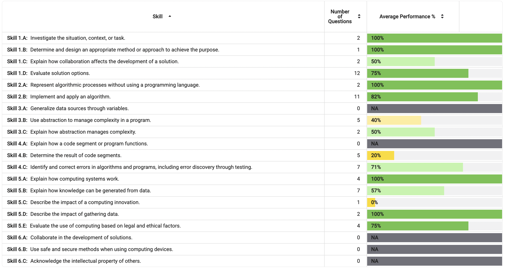

# 🎨 Cantella Retrospective Blog 🚀

## **🔎 Index**
- [🌐 Profile Feature: Core CPT Requirements & Implementation](#-profile-feature-core-cpt-requirements--implementation)
- [🎨 Role as UX Engineer](#-role-as-ux-engineer)
- [🎤 Night at the Museum (N@tM) Presentation](#-night-at-the-museum-natm-presentation)
- [📝 Personal Reflection: Strengths & Weaknesses](#-personal-reflection-strengths--weaknesses)
- [🚀 Future Plans & Next Steps](#-future-plans--next-steps)
- [🎯 Summary for Live Review](#-summary-for-live-review)

# Cantella & My Feature
- Cantella is a social media for students where there are usefull study tools and student interaction through my profile features where users can create, edit, delete, and see other peoples' profiles which includes school-related fields. 

---

# 🌐 **Profile Feature: CPT & Implementation**

## **📌 GitHub Issues & Burndown List**
🔗 <a href="https://github.com/XavierTho/cantella_backend/issues/27#issue-2776751759" >Profiles Github Issue</a>

---

## **🛠️ 1. Setting Up an API (Starting with Static Data)**

### **CPT Requirement: Data Abstraction & Program Implementation**
- **What I Did:**
  - Started with **static data** to simulate profile storage before integrating a database.
  - Built an **API using Flask & Flask-RESTful**, setting up basic GET/POST routes.

### **Code Example:**
```python
# Blueprint setup
profile_api = Blueprint('profile_api', __name__, url_prefix='/api')
api = Api(profile_api)

# Static Data (Initial Setup)
profiles = [
    {"id": 1, "name": "Arush", "favorite_class": "Math", "grade": "B"},
    {"id": 2, "name": "John", "favorite_class": "Science", "grade": "A"}
]
```

### **How This Meets CPT Requirements:**
✅ **Data Abstraction:** Started with a simple list structure before transitioning to a full database.

✅ **Modularity:** Used Flask **Blueprints** for better organization.

✅ **Algorithmic Thinking:** Designed RESTful API endpoints for future integration.

---

## **💾 2. Setting Up a Model & Database (Ensuring Data Persistence)**

### **CPT Requirement: Data Storage & Testing**
- **What I Did:**
  - Designed a **Profile model** in SQLAlchemy.
  - Created a **relational database table** to store user data persistently, including the tester data.
  - Used **Postman** to verify CRUD operations before implementing the frontend.

### **Database Table Structure:**
📸 

### **Code Example:**
```python
class Profile(db.Model):
    __tablename__ = 'profiles'

    id = db.Column(db.Integer, primary_key=True)
    _name = db.Column(db.String(255), nullable=False)  # User's name
    _classes = db.Column(db.JSON, nullable=False)  # JSON column to store classes
    _favorite_class = db.Column(db.String(255), nullable=False)  # Favorite class
    _grade = db.Column(db.String(10), nullable=False)  # Grade
```

### **Postman Testing:**
📌 **Tested API endpoints for:**
- **GET /api/profiles** → Fetch all profiles.
- **POST /api/profiles** → Add new profiles.
- **PUT /api/profiles** → Update an existing profile.
- **DELETE /api/profiles** → Remove profiles.

### **How This Meets CPT Requirements:**
✅ **Data Storage:** Ensured user data is stored persistently in a database.

✅ **Testing & Debugging:** Used Postman to verify API functionality.

✅ **Program Implementation:** Designed models using SQLAlchemy ORM.

---

## **🌍 3. Full Stack Integration (Connecting API to Frontend)**

### **CPT Requirement: Data Representation & User Interaction**
- **What I Did:**
  - Created a **frontend UI** that dynamically interacts with the backend.
  - Used **JavaScript Fetch API** to display profiles in real-time.
  - Ensured users could **create, read, update, and delete profiles** seamlessly.
  - Learned the implementation of fullstack through **tech talks**


### **Code Example:**
```javascript
  try {
      const response = await fetch(`${API_BASE}`, {
      method: 'PUT',
      headers: { 'Content-Type': 'application/json' },
      body: JSON.stringify(data),
      credentials: 'include'
     });
```


### **How This Meets CPT Requirements:**
✅ **User Interaction:** Created a seamless UI for profile management.

✅ **Data Representation:** Dynamically displayed profile data from API calls.

✅ **Integration:** Connected **backend API with frontend logic**.

---

### **Live Demo of Profile Feature 🎥**

# 🎨 **Role as UX Engineer**

## **📌 GitHub Issues & Burndown List**

🔗 <a href="https://github.com/XavierTho/cantella_frontend/issues/76" >UX Engineer Github Issue</a>

---


## **📚 4. Flashcards Page - Streamlined User Experience**
🎯 **Objective:** Enhance functionality and ease of use.
🛠 **Implementation:**
- Used **progressive disclosure** to reveal UI elements only when needed.
- Designed a clean interface where **"Add New Flashcard"** appears only after selecting a deck.
- Utilized **conditional rendering** in JavaScript.


📊 **Flashcards Flowchart:** *(inspriation from the student panel)*


---

## **🎨 5. General Aesthetics & Website Unity**
🎯 **Objective:** Maintain a professional and cohesive UI.
🎨 **Implementation:**
- Used **grey background with orange accents** throughout different pages on the site for consistency.
- Standardized UI elements across all pages.
- Added **favicons (pencil & trashcan icons) and delete sound effect** for usability.


---

<!-- College Board CPT Requirements Met -->
<section style="background-color: #e3f2fd; padding: 20px; border-left: 5px solid #0d6efd; border-radius: 10px; margin-top: 20px;">
    <h2 style="color: #0d6efd;">🎯 College Board CPT Requirements Met</h2>

    <p>Throughout the development of <b>Cantella</b>, I met several <b>CPT requirements</b>, demonstrating key programming and problem-solving skills.</p>

    <!-- Grid Layout for CPT Requirements -->
    <div style="display: grid; grid-template-columns: repeat(2, 1fr); gap: 15px; margin-top: 15px;">
        
        <!-- Data Abstraction -->
        <div style="background-color: #bbdefb; padding: 15px; border-radius: 8px; box-shadow: 2px 2px 10px rgba(0,0,0,0.1);">
            <h3 style="color: #0b5ed7;">📂 Data Abstraction</h3>
            <p>Used <b>SQLAlchemy models</b> to store, retrieve, and manipulate structured user profile data.</p>
        </div>

        <!-- Program Implementation -->
        <div style="background-color: #bbdefb; padding: 15px; border-radius: 8px; box-shadow: 2px 2px 10px rgba(0,0,0,0.1);">
            <h3 style="color: #0b5ed7;">🖥️ Program Implementation</h3>
            <p>Developed <b>RESTful API endpoints</b> with Flask, handling profile CRUD operations efficiently.</p>
        </div>

        <!-- Algorithms & Control Structures -->
        <div style="background-color: #bbdefb; padding: 15px; border-radius: 8px; box-shadow: 2px 2px 10px rgba(0,0,0,0.1);">
            <h3 style="color: #0b5ed7;">🔄 Algorithms & Control Structures</h3>
            <p>Implemented <b>conditional rendering</b> in JavaScript to improve the user experience in the Flashcards feature.</p>
        </div>

        <!-- Data Management -->
        <div style="background-color: #bbdefb; padding: 15px; border-radius: 8px; box-shadow: 2px 2px 10px rgba(0,0,0,0.1);">
            <h3 style="color: #0b5ed7;">📊 Data Management</h3>
            <p>Verified <b>database integrity</b> and CRUD functionality through <b>Postman API testing</b>.</p>
        </div>

        <!-- Testing & Debugging -->
        <div style="background-color: #bbdefb; padding: 15px; border-radius: 8px; box-shadow: 2px 2px 10px rgba(0,0,0,0.1);">
            <h3 style="color: #0b5ed7;">🐞 Testing & Debugging</h3>
            <p>Identified and fixed usability issues, including <b>profile form scrolling bugs</b> and UI inconsistencies.</p>
        </div>

        <!-- User Interaction & Data Representation -->
        <div style="background-color: #bbdefb; padding: 15px; border-radius: 8px; box-shadow: 2px 2px 10px rgba(0,0,0,0.1);">
            <h3 style="color: #0b5ed7;">👥 User Interaction & Data Representation</h3>
            <p>Designed a <b>responsive UI</b> with dynamic updates using <b>JavaScript Fetch API</b>.</p>
        </div>

    </div>

    <p style="margin-top: 15px;"><b>These CPT requirements highlight my ability to design, develop, and optimize full-stack applications with structured data management.</b> 🚀</p>
</section>


# 🎤 **Night at the Museum (N@tM) Presentation**

 
 

<div>


</div>

## 🎤 Night at the Museum (N@tM) Feedback Summary  

<table>
  <tr>
    <th style="color: #4CAF50; font-size: 18px;">✅ Positive Feedback</th>
    <th style="color: #FF9800; font-size: 18px;">🔹 Areas for Improvement</th>
  </tr>
  <tr>
    <td>
      <ul>
        <li><b>User Interface & Design</b> – Many users praised the <b>UI and front-end design</b>, mentioning that it looked <b>cool, interactive, and well-structured</b>.</li>
        <li><b>Functionality & Concept</b> – Users appreciated the <b>storage system, software development process, and overall concept</b> of the project.</li>
        <li><b>Engagement & Features</b> – People liked the <b>US History quiz, interactivity, and ability to store information</b> effectively.</li>
      </ul>
    </td>
    <td>
      <ul>
        <li><b>Feature Expansion</b> – Feedback suggested adding <b>more features</b>, such as <b>additional AP subjects</b> and making the <b>pages look more uniform</b>.</li>
        <li><b>Navigation & UI Improvements</b> – Some mentioned that <b>layout adjustments</b> and a <b>more sophisticated CSS design</b> could enhance the user experience.</li>
      </ul>
    </td>
  </tr>
</table>

---

### 🚀 **Suggestions for Future Development**
<table>
  <tr>
    <td style="background-color: #2196F3; color: white; padding: 10px;"><b>🛠 More Interactive Elements</b></td>
    <td>Users wanted <b>dynamic questions</b> and more ways to engage with the platform.</td>
  </tr>
  <tr>
    <td style="background-color: #009688; color: white; padding: 10px;"><b>📚 Expanded Course Offerings</b></td>
    <td>Requests were made to <b>include more AP courses</b> beyond the current selection.</td>
  </tr>
  <tr>
    <td style="background-color: #FF5722; color: white; padding: 10px;"><b>👥 Improved Social Interaction</b></td>
    <td>Users suggested adding <b>peer interaction features</b> to make the platform more engaging.</td>
  </tr>
</table>

---

### ⭐ **Overall Project Rating**
<center>
  <p style="font-size: 20px; color: #FFD700;"><b>🌟 4.5/5</b></p>
  <p>The majority of participants rated the project highly, showing strong appreciation for its functionality and design.</p>
</center>

This feedback provides great insight into **what worked well** and **what needs improvement** for future iterations of Cantella! 🚀

---

# 📝 **Personal Reflection: Strengths & Weaknesses**

| **Strengths** | **Weaknesses** |
|--------------|---------------|
| *Communication/Collaboration:* I was able to communicate very well with my group, setting up meetings, calls, and more. We were able to stay on the same page a lot which helped streamline this project. Additionally, we shared ideas very beneficially and were able to collaborate clearly, avoiding conflicts. | I think I can be more active in class and ask more questions to get to my answers faster. I will definetely work in this next tri. |
| *Troubleshooting:* I have been able to quickly understand challenges and issues that arose in our project which was very beneficial to troubleshoot for the whole group to be more productive. | At times, I have relied on last minute efforts to finish my work which could be done better with better time management. |
| *Adaptability:* I have been able to adapt during this project which has proven beneficial to my team and my personal work. It has been key to making sure I can work around the many issues that arise while working on code. It is something that I have grown in during the tri, and aqcquired while working on more and more things. | Sometimes I may focus on certain problems/goals within the project too much, which makes me spend too much time on things that may be more unnecessary. I can improve this my creating lists to clearly see what is the most important and first priority of work. These lists would improve efficiency greatly. |


<h3> <b>Solutions:</b> Next trimester I will focus on a few main things. Asking more questions, participating more in class, and creating more burndown lists and issues to be more clear on my work. 
</h3>
---

# 🚀 **Future Plans & Next Steps**

## **🌟 Future of Cantella**
- Adding **dark mode** for accessibility.
- Adding more fields to my profile feature for more student user info - possible connecting to other features like quizzes and flashcards
- Adding a chat so users can interact more

## **🎓 Future Projects & Application of CSP Knowledge**
- Majoring in **Data Science**.
- Attending **Boston University Data Science Summer Course**.
- Future projects - already thinking of ideas like a DMV appointment notify site.

---

<!-- Reaching Out & Helping Someone Section -->
<section style="background-color: #f8f9fa; padding: 20px; border-radius: 10px; margin-top: 20px;">
    <h2 style="color: #007bff;">🤝 Collaboration with Brandon Smurlo</h2>
    
    <p><b>For the final review, I partnered with Brandon Smurlo from a different period.</b> We helped each other prepare by setting up materials, reviewing each other’s websites, and conducting a <b>mock presentation</b> of our projects.</p>

    <!-- Image of Studying Together -->
    <div style="text-align: center; margin-bottom: 15px;">
        
        <p style="font-size: 14px; color: #555;">📸 Studying together for the final exam</p>
    </div>

    <h3 style="color: #28a745;">🔍 Feedback from Brandon on My Blog & Website</h3>

    <ul style="list-style-type: none; padding-left: 0;">
        <li style="background-color: #e9ecef; padding: 10px; border-radius: 5px; margin-bottom: 5px;">
            📝 <b>Blog Readability:</b> "The blog's format makes it difficult to pick out individual sections that work to fulfill each requirement."
        </li>
        <li style="background-color: #e9ecef; padding: 10px; border-radius: 5px; margin-bottom: 5px;">
            🎨 <b>Visual Enhancements:</b> More visuals instead of mostly text would help readers engage with key takeaways.
        </li>
        <li style="background-color: #e9ecef; padding: 10px; border-radius: 5px; margin-bottom: 5px;">
            📊 <b>Flowchart Feedback:</b> The flowchart is "very thought out and effective in conveying the steps you took to complete your feature."
        </li>
        <li style="background-color: #e9ecef; padding: 10px; border-radius: 5px; margin-bottom: 5px;">
            🖥️ <b>Website Design:</b> "I can tell that a lot of thought went into each and every feature, button, and animation."
        </li>
        <li style="background-color: #e9ecef; padding: 10px; border-radius: 5px; margin-bottom: 5px;">
            ⚠️ <b>Usability Issue:</b> When adding a new profile, the form appears at the bottom of the page, requiring users to scroll down—this is inconvenient.
        </li>
    </ul>

    <h3 style="color: #17a2b8;">📌 How This Helped Me Prepare</h3>
    <p>
        Brandon's feedback allowed me to pinpoint areas that need improvement before the final review. Based on his suggestions, I will:
    </p>
    <ul>
        <li>🔹 Improve the <b>blog's organization</b> to make requirements clearer.</li>
        <li>🔹 Add <b>more visuals</b> to break up text-heavy sections.</li>
        <li>🔹 Fix the <b>profile creation UI issue</b> so users immediately see when a new profile is added.</li>
    </ul>

    <p><b>By exchanging feedback and practicing presentations, we both strengthened our final exam preparation.</b> This collaboration gave us a fresh perspective on our projects and helped refine our work.</p>
</section>

<!-- MCQ Performance Section -->
<section style="background-color: #fff3cd; padding: 15px; border-left: 5px solid #ffc107; border-radius: 8px; margin-top: 20px;">
    <h2 style="color: #d39e00;">🧠 MCQ Performance & Improvement Plan</h2>

    <p>
        For the multiple-choice section, I scored <b>46/67</b>. While this is a solid score, there is room for improvement before the AP exam.
        My key areas for growth include:
    </p>

    <ul>
        <li>📌 Reviewing <b>missed concepts</b> by analyzing my incorrect answers.</li>
        <li>📌 Practicing with <b>more timed MCQ tests</b> to improve speed and accuracy.</li>
        <li>📌 Strengthening <b>algorithm-related questions</b> to ensure better performance.</li>
    </ul>

    <!-- Space for Screenshot -->
    <div style="text-align: center; margin-top: 10px;">
        
        <p style="font-size: 14px; color: #555;">📸 Screenshot of MCQ Scoring Report</p>
    </div>

    <p>
        Moving forward, I will focus on <b>targeted practice</b> and <b>concept reinforcement</b> to improve my score before the AP test. 🚀
    </p>
</section>

<div>


</div>


<!-- 🎯 AP CSP Personalized Project Reference (PPR) FRQ -->
<section style="background-color: #e3f2fd; padding: 20px; border-left: 5px solid #1e88e5; border-radius: 8px; margin-top: 20px;">
    <h2 style="color: #1565c0;">🚀 AP CSP Personalized Project Reference (PPR) FRQ</h2>
    <p>
        Below are my <b>code segments</b> that meet the <b>AP CSP requirements</b>, formatted creatively for clarity and readability.
    </p>
</section>

<!-- 🛠️ Part 1: Student-Developed Procedure -->
<section style="background-color: #fff3cd; padding: 15px; border-left: 5px solid #ffc107; border-radius: 8px; margin-top: 20px;">
    <h2 style="color: #d39e00;">🛠️ Part 1: Self-Developed Procedure</h2>

    <p><b>📌 Requirement:</b></p>
    <ul>
        <li>✔ Defines a <b>procedure name</b> and <b>return type</b> (if necessary).</li>
        <li>✔ Uses <b>one or more parameters</b> that impact functionality.</li>
        <li>✔ Implements an <b>algorithm with sequencing, selection, and iteration</b>.</li>
    </ul>

    <h3>💡 Student-Developed Procedure</h3>
    <pre style="background-color: #272822; color: #f8f8f2; padding: 15px; border-radius: 8px; overflow-x: auto;">
<code style="font-family: monospace; color: #f92672;">def</code> <code style="color: #a6e22e;">add_class</code>(self, class_name):
    <code style="color: #f92672;">if</code> class_name <code style="color: #f92672;">not in</code> self._classes:  <code style="color: #75715e;"># Selection: checks if class is already in list</code>
        self._classes.append(class_name)  <code style="color: #75715e;"># Sequencing: modifies the list</code>
        db.session.commit()  <code style="color: #75715e;"># Saves changes to the database</code>
        <code style="color: #f92672;">return</code> True
    <code style="color: #f92672;">return</code> False
    </pre>

    <h4>📝 Explanation</h4>
    <ul>
        <li>🔹 <b>Procedure Name:</b> add_class</li>
        <li>🔹 <b>Parameter:</b> class_name</li>
        <li>🔹 <b>Selection:</b> <code>if class_name not in self._classes</code></li>
        <li>🔹 <b>Iteration:</b> While no explicit loop is present, this function modifies data iteratively over time.</li>
    </ul>
</section>

<!-- 📞 Part 2: Procedure Call in Program -->
<section style="background-color: #e8f5e9; padding: 15px; border-left: 5px solid #43a047; border-radius: 8px; margin-top: 20px;">
    <h2 style="color: #2e7d32;">📞 Part 2: Procedure Call in Program</h2>
    <p>The procedure is called inside the <b>Profile API</b> when modifying a user’s profile.</p>

    <pre style="background-color: #272822; color: #f8f8f2; padding: 15px; border-radius: 8px; overflow-x: auto;">
<code style="font-family: monospace; color: #f92672;">profile</code> = Profile.query.get(data['id'])
<code style="color: #f92672;">if</code> profile:
    profile.add_class(data['new_class'])  <code style="color: #75715e;"># Calls the procedure to add a class</code>
    </pre>

    <p><b>📌 Why This is Important?</b></p>
    <ul>
        <li>✔ Ensures <b>data integrity</b> by checking if the class already exists.</li>
        <li>✔ Helps <b>modularize functionality</b>, keeping API calls clean and efficient.</li>
    </ul>
</section>

<!-- 📋 Part 3: List Usage for Managing Complexity -->
<section style="background-color: #fbe9e7; padding: 15px; border-left: 5px solid #e53935; border-radius: 8px; margin-top: 20px;">
    <h2 style="color: #b71c1c;">📋 Part 3: List Usage for Managing Complexity</h2>
    <p><b>📌 Requirement:</b></p>
    <ul>
        <li>✔ First Code Segment: Shows how data is stored in the list.</li>
        <li>✔ Second Code Segment: Shows how the stored list data is accessed and used.</li>
    </ul>

    <h3>📂 Storing Data in a List (JSON Format)</h3>
    <pre style="background-color: #272822; color: #f8f8f2; padding: 15px; border-radius: 8px; overflow-x: auto;">
<code style="font-family: monospace; color: #ffffff;">p1 = Profile(name='Arush Shah', classes=['Math', 'Science', 'History'], favorite_class='Science', grade='A')</code>
    </pre>

    <p><b>📌 Explanation:</b></p>
    <ul>
        <li>✅ Stores multiple classes in a list (<code>classes</code>) inside a <code>Profile</code> object.</li>
        <li>✅ Uses JSON format for structured data storage in a database.</li>
    </ul>

    <h3>📊 Using Data from the List</h3>
    <pre style="background-color: #272822; color: #f8f8f2; padding: 15px; border-radius: 8px; overflow-x: auto;">
<code style="font-family: monospace; color: #f92672;">def</code> read(self):
    <code style="color: #f92672;">return</code> {
        'id': self.id,
        'name': self.name,
        'classes': self.classes,  <code style="color: #75715e;"># Accessing list data</code>
        'favorite_class': self.favorite_class,
        'grade': self.grade,
    }
    </pre>

    <p><b>📌 Explanation:</b></p>
    <ul>
        <li>✔ The <code>read()</code> function retrieves the stored list and makes it accessible via API calls.</li>
        <li>✔ The <code>classes</code> list is dynamically used for front-end rendering.</li>
    </ul>
</section>

<!-- 🌟 Summary & Takeaways -->
<section style="background-color: #ede7f6; padding: 15px; border-left: 5px solid #673ab7; border-radius: 8px; margin-top: 20px;">
    <h2 style="color: #4527a0;">🌟 Summary & Takeaways</h2>
    <ul>
        <li>✅ Implemented a <b>student-developed procedure</b> with sequencing, selection, and iteration.</li>
        <li>✅ Used <b>lists to manage complexity</b>, storing and retrieving multiple class values dynamically.</li>
        <li>✅ <b>API successfully calls the procedure</b>, proving functional integration.</li>
    </ul>

</section>


## 📝 Self-Grade Assessment

### 📊 Main Evaluation (9 Points)
<table border="1" cellpadding="8" cellspacing="0">
  <tr>
    <th>Criteria</th>
    <th>Self-Grade</th>
    <th>Explanation</th>
  </tr>
  <tr>
    <td>🖐 <b>Five things I did over 12 weeks</b> (5 pts)</td>
    <td>4.5/5</td>
    <td>I accomplished a lot in the 12 weeks and learned a lot, especially through the 5 things I presented. I could have asked more questions during this process, though</td>
  </tr>
  <tr>
    <td>🎥 <b>Full Stack Project Demo</b> (2 pts)</td>
    <td>2/2</td>
    <td>My feature has full stack implementation.</td>
  </tr>
  <tr>
    <td>📝 <b>Project Feature Blog Write-Up (CPT/FRQ Language)</b> (1 pt)</td>
    <td>1/1</td>
    <td>This blog includes on how I completed CPT requirements through my work.</td>
  </tr>
  <tr>
    <td>🧠 <b>MCQ Section</b> (1 pt)</td>
    <td>1/1</td>
    <td>Explanation of performance on the MCQs and accuracy in responses.</td>
  </tr>
</table>

---

### ⭐ Bonus: 10th Point
<table border="1" cellpadding="8" cellspacing="0">
  <tr>
    <th>Ideas for the 10th Point</th>
    <th>Completed? ✅</th>
  </tr>
  <tr>
    <td>🔍 <b>Taking extreme interest in other projects & people (N@tM reviews, event chronicling, personalization)</b></td>
    <td>🛠</td>
  </tr>
  <tr>
    <td>🤝 <b>Helping a new person get Final Exam materials organized</b></td>
    <td>✅</td>
  </tr>
  <tr>
    <td>🎤 <b>Performing a practice/preliminary live review with a peer</b></td>
    <td>✅</td>
  </tr>
  <tr>
    <td>🎯 <b>Thinking ahead – next steps in CompSci, career, internships, future classes</b></td>
    <td>✅</td>
  </tr>
  <tr>
    <td>💡 <b>Reflecting on personal strengths & weaknesses in detail</b></td>
    <td>✅</td>
  </tr>
  <tr>
    <td>📈 <b>Creating next steps for the project (plans, improvements, future direction)</b></td>
    <td>✅</td>
  </tr>
  <tr>
    <td>📩 <b>Sending a summary of talking points 24 hours in advance</b></td>
    <td>✅</td>
  </tr>
  <tr>
    <td>⏳ <b>Being able to clearly highlight all 10 points within 3 minutes during the live review</b></td>
    <td>✅</td>
  </tr>
  <tr>
    <td>⚠️ <b>EXTRA: Implement knowledge from the student panel meating -> Flowchards</b></td>
    <td>✅</td>
  </tr>
</table>

---

### 📌 Final Reflection
_Final Grade: 9/10_
